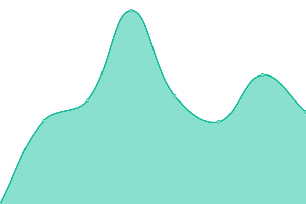
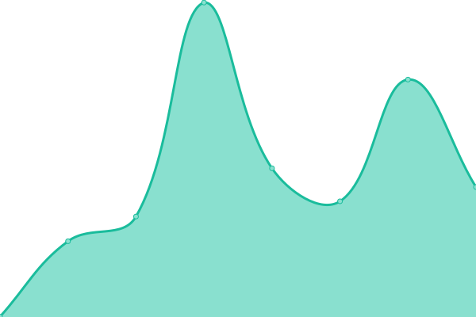

# [📈 Live Status](https://Oscarozo.github.io/upptime): <!--live status--> **🟧 Partial outage**

This repository contains the open-source uptime monitor and status page for [Oscar](https://Oscarozo.github.io/upptime), powered by [Upptime](https://github.com/upptime/upptime).

With [Upptime](https://upptime.js.org), you can get your own unlimited and free uptime monitor and status page, powered entirely by a GitHub repository. We use [Issues](https://github.com/Oscarozo/upptime/issues) as incident reports, [Actions](https://github.com/Oscarozo/upptime/actions) as uptime monitors, and [Pages](https://Oscarozo.github.io/upptime) for the status page.

<!--start: status pages-->
<!-- This summary is generated by Upptime (https://github.com/upptime/upptime) -->
<!-- Do not edit this manually, your changes will be overwritten -->
<!-- prettier-ignore -->
| URL | Status | History | Response Time | Uptime |
| --- | ------ | ------- | ------------- | ------ |
|  [Google](https://www.google.com.py) | 🟩 Up | [google.yml](https://github.com/Oscarozo/upptime/commits/HEAD/history/google.yml) | 

 159ms
     
 | 

<a href="https://Oscarozo.github.io/upptime/history/google">100.00%</a>
    

|  [Facebook](https://es-la.facebook.com) | 🟩 Up | [facebook.yml](https://github.com/Oscarozo/upptime/commits/HEAD/history/facebook.yml) | 

 405ms
     
 | 

<a href="https://Oscarozo.github.io/upptime/history/facebook">100.00%</a>
    

|  [Twitter](https://twitter.com) | 🟩 Up | [twitter.yml](https://github.com/Oscarozo/upptime/commits/HEAD/history/twitter.yml) | 

 487ms
     
 | 

<a href="https://Oscarozo.github.io/upptime/history/twitter">100.00%</a>
    

|  [Youtube](https://www.youtube.com) | 🟩 Up | [youtube.yml](https://github.com/Oscarozo/upptime/commits/HEAD/history/youtube.yml) | 

 238ms
     
 | 

<a href="https://Oscarozo.github.io/upptime/history/youtube">100.00%</a>
    

|  [ABC](https://www.abc.com.py) | 🟩 Up | [abc.yml](https://github.com/Oscarozo/upptime/commits/HEAD/history/abc.yml) | 

 800ms
     
 | 

<a href="https://Oscarozo.github.io/upptime/history/abc">100.00%</a>
    

|  [Ultima_Hora](https://www.ultimahora.com) | 🟩 Up | [ultima-hora.yml](https://github.com/Oscarozo/upptime/commits/HEAD/history/ultima-hora.yml) | 

 752ms
     
 | 

<a href="https://Oscarozo.github.io/upptime/history/ultima-hora">100.00%</a>
    

|  [Educa](https://ead.pol.una.py/sitio/) | 🟥 Down | [educa.yml](https://github.com/Oscarozo/upptime/commits/HEAD/history/educa.yml) | 

 0ms
     
 | 

<a href="https://Oscarozo.github.io/upptime/history/educa">0.00%</a>
    

|  [MiParaguay](http://www.miparaguay.dk) | 🟥 Down | [mi-paraguay.yml](https://github.com/Oscarozo/upptime/commits/HEAD/history/mi-paraguay.yml) | 

 0ms
     
 | 

<a href="https://Oscarozo.github.io/upptime/history/mi-paraguay">100.00%</a>
    

<!--end: status pages-->

[**Visit our status website →**](https://Oscarozo.github.io/upptime)

## 📄 License

- Powered by: [Upptime](https://github.com/upptime/upptime)
- Code: [MIT](./LICENSE) © [Oscar](https://Oscarozo.github.io/upptime)
- Data in the `./history` directory: [Open Database License](https://opendatacommons.org/licenses/odbl/1-0/)
